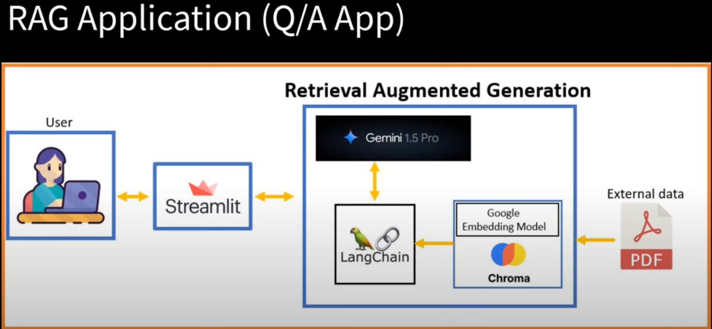
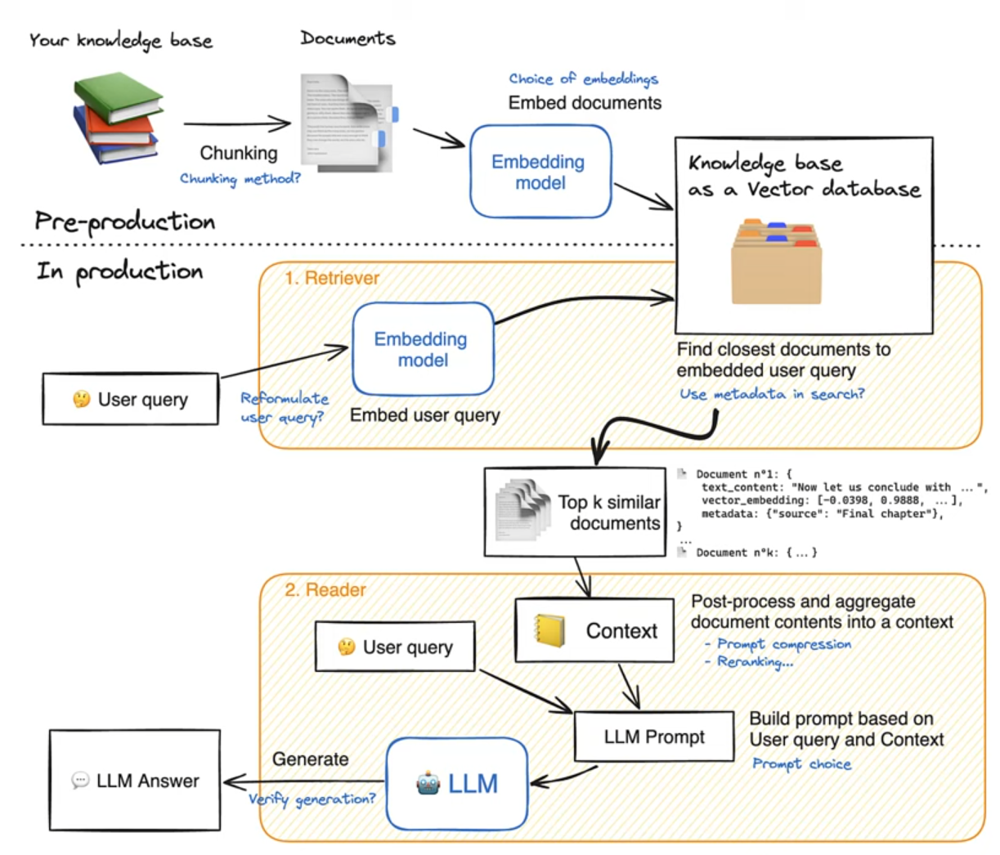

# **Q&A Application with Retrieval-Augmented Generation (RAG) using Gemini Pro and LangChain**

## Overview
This project implements a **Q&A Application** that leverages **Gemini Pro** for both embedding and chat models, integrated with **LangChain** for a **retrieval-augmented generation (RAG)** pipeline. It allows users to upload PDF documents and query them interactively.

## Flow of the Application
The flow of the application is illustrated in the diagram below, which can also be found in the accompanying notebook (Q&A_APP.ipynb):

## Key Features
- **Streamlit Interface**: Dynamic web interface for interactive Q&A.
- **PDF Processing**: Upload and chunk PDFs for context retrieval.
- **Gemini Pro Integration**: 
  - Embedding model for text chunk embeddings.
  - Chat model for context-aware responses.
- **Chroma Vector Store**: Efficient similarity-based document retrieval.
- **Real-time Q&A**: Interactive session for asking multiple questions.
